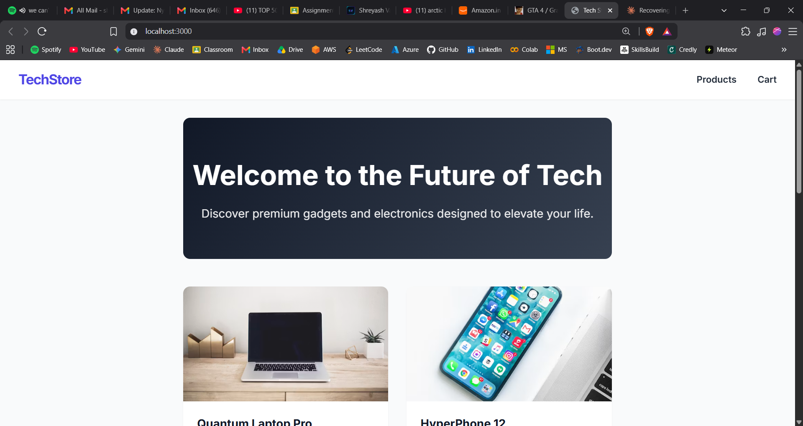
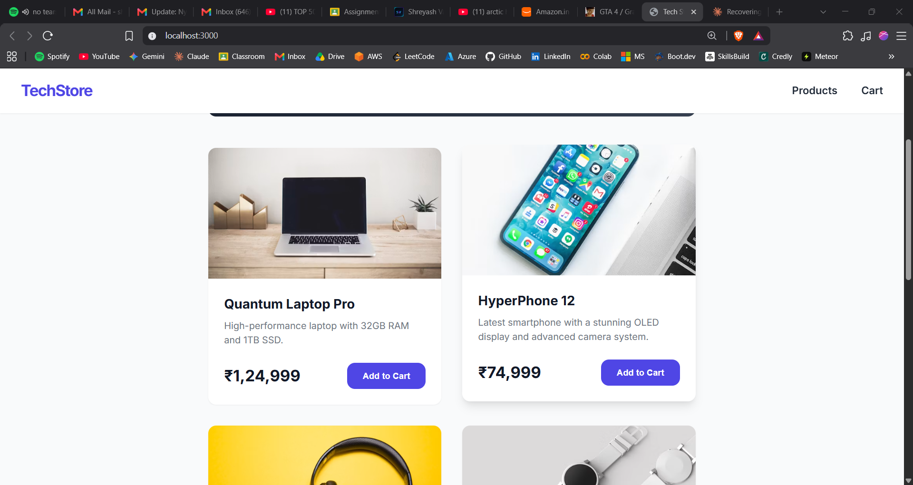
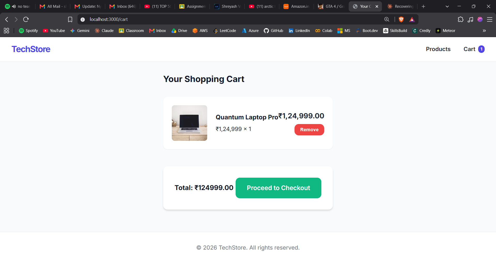
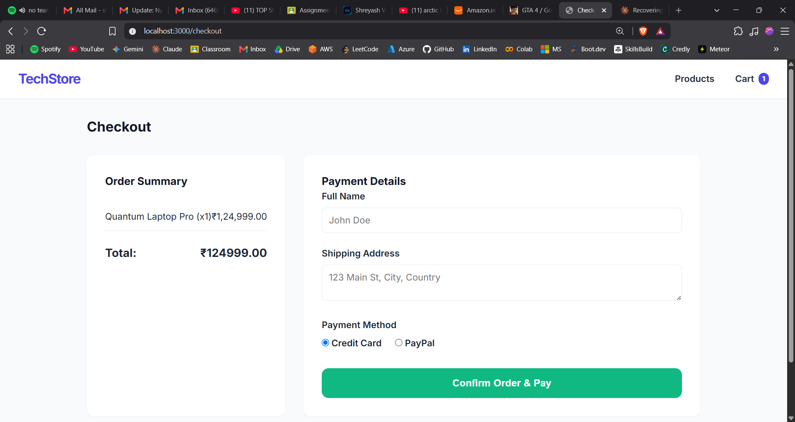
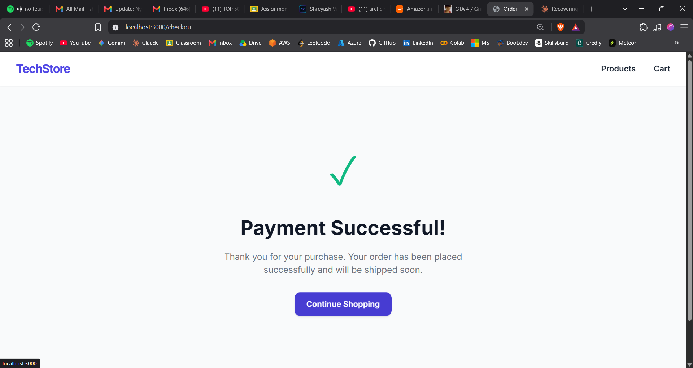

# 🛒 TechStore — Monolithic E-Commerce Application

A full-stack e-commerce web application built using a **monolithic architecture**. The entire application — routing, business logic, database access, and server-side rendering — lives in a single Node.js process. Built as a practical demonstration of the traditional monolithic approach before migrating to microservices.



---

## 📐 Architecture Overview

```
┌──────────────────────────────────────────────┐
│              Client (Browser)                │
│         Server-rendered EJS pages            │
└──────────────────┬───────────────────────────┘
                   │ HTTP
                   ▼
┌──────────────────────────────────────────────┐
│          Express.js Server (3000)            │
│                                              │
│  ┌────────────┐ ┌──────────┐ ┌───────────┐  │
│  │  Routes    │ │ Sessions │ │ Templates │  │
│  │ (server.js)│ │(express- │ │  (EJS)    │  │
│  │            │ │ session) │ │           │  │
│  │ GET /      │ └──────────┘ │ index.ejs │  │
│  │ GET /cart  │              │ cart.ejs  │  │
│  │ POST /cart │ ┌──────────┐ │ checkout  │  │
│  │ GET /check │ │ DB Layer │ │ success   │  │
│  │ POST /chek │ │ (db.js)  │ │ layout    │  │
│  └────────────┘ └────┬─────┘ └───────────┘  │
│                      │                       │
└──────────────────────┼───────────────────────┘
                       │
                       ▼
              ┌────────────────┐
              │   MySQL 8      │
              │   (ecom_db)    │
              └────────────────┘
```

**Everything runs in a single process** — routes, session handling, database queries, and template rendering are all tightly coupled in one application.

---

## 🧰 Tech Stack

| Layer            | Technology                |
| ---------------- | ------------------------- |
| **Runtime**      | Node.js                   |
| **Framework**    | Express.js 5              |
| **Database**     | MySQL 8                   |
| **Templating**   | EJS (server-side rendered)|
| **Sessions**     | express-session           |
| **Styling**      | Vanilla CSS               |
| **Containers**   | Docker + Docker Compose   |

---

## 🗂 Project Structure

```
ecom/
├── server.js              # Main application — all routes & logic
├── db.js                  # Database connection pool + schema init + seed
├── package.json           # Dependencies
├── dockerfile             # Container image for the app
├── docker-compose.yml     # Multi-container setup (app + MySQL)
├── .dockerignore          # Files excluded from Docker build
├── views/                 # EJS templates (server-side rendered)
│   ├── layout.ejs         # Base layout with navbar
│   ├── index.ejs          # Home page — product listing
│   ├── cart.ejs           # Shopping cart
│   ├── checkout.ejs       # Checkout form
│   └── success.ejs        # Order confirmation
├── public/                # Static assets
│   └── style.css          # Application styles
└── photos/                # Screenshots for documentation
```

---

## 🚀 Getting Started

### Prerequisites

- **Node.js** ≥ 18
- **MySQL 8** running locally (or use Docker)

### Option 1: Run Locally

```bash
# Install dependencies
npm install

# Start the server (MySQL must be running on localhost:3306)
node server.js
```

The app auto-creates the `ecom_db` database, all tables, and seeds 6 sample products on first run.

Open **http://localhost:3000**

### Option 2: Run with Docker (Recommended)

```bash
docker compose up --build
```

This starts both the **Node.js app** and a **MySQL 8** container with a health check — no local MySQL needed.

Open **http://localhost:3000**

---

## 🗄 Database Schema

All tables are auto-created by `db.js` on application startup:

| Table          | Purpose                                      |
| -------------- | -------------------------------------------- |
| `products`     | Product catalog (name, description, price, image) |
| `carts`        | Session-based shopping carts                 |
| `cart_items`   | Items in a cart (linked to product)          |
| `orders`       | Completed orders with customer info          |
| `order_items`  | Line items within an order                   |

---

## 🖼 Application Screenshots

### Home Page — Product Listing

Browse all available tech products with prices in INR.


---

### Product Catalog

View the full product grid with images, descriptions, and prices.



---

### Shopping Cart

Add items, view quantities, and see the running total.



---

### Checkout

Enter customer details and select a payment method.



---

### Order Confirmation

Successful order placement with session reset.



---

## 🐳 Docker Configuration

### Dockerfile

```dockerfile
FROM node:latest
WORKDIR /usr/src/app
COPY package*.json ./
RUN npm install
COPY . .
EXPOSE 3000
CMD ["node", "server.js"]
```

### Docker Compose

The `docker-compose.yml` defines two services:

- **`app`** — The Node.js application container (port 3000)
- **`db`** — MySQL 8 container with persistent volume and health check

The app container waits for MySQL to be healthy before starting, using the `depends_on` condition.

---
built for academic purposes as part of a Cloud Computing course.
