# 🛒 MinimalStore — Cloud-Native E-Commerce Platform

A full-stack e-commerce web application built using a **microservices architecture**. The system is decomposed into independently deployable services — each responsible for a single domain — communicating through a central **API Gateway**. Built as a practical demonstration of cloud computing principles including service decomposition, independent scaling, and fault isolation.

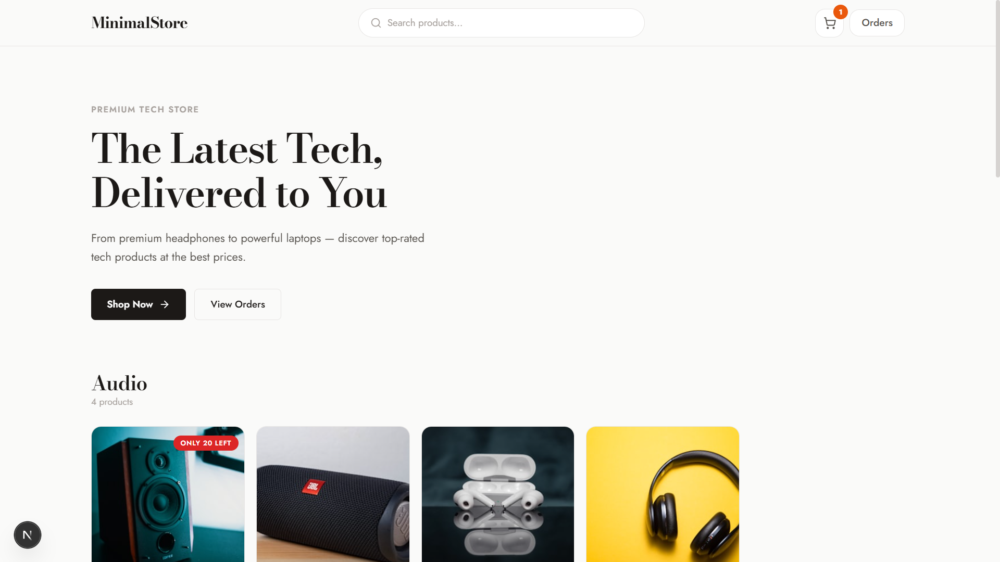

---

## 📐 Architecture Overview

```
┌─────────────────────────────────────────────────────────────────┐
│                     Next.js Frontend (3000)                     │
│              Server-side rendering + Client SPA                 │
└──────────────────────────┬──────────────────────────────────────┘
                           │
                           ▼
┌─────────────────────────────────────────────────────────────────┐
│                   API Gateway (4000)                            │
│          Reverse proxy — routes requests to services            │
└───┬──────┬──────┬──────┬──────┬──────┬──────┬───────────────────┘
    │      │      │      │      │      │      │
    ▼      ▼      ▼      ▼      ▼      ▼      ▼
 Product Search  Cart  Order Payment Review  User
 (4001) (4002) (4003) (4004) (4005)  (4006) (4008)
    │      │      │      │      │      │      │
    └──────┴──────┴──────┴──────┴──────┴──────┘
                           │
                           ▼
              ┌─────────────────────┐
              │  PostgreSQL (Prisma)│
              │   DB Service (4010) │
              └─────────────────────┘
```

---

## 🧰 Tech Stack

| Layer           | Technology                            |
| --------------- | ------------------------------------- |
| **Frontend**    | Next.js 16, React 19, Tailwind CSS 4  |
| **Backend**     | Node.js, Express 5, TypeScript        |
| **API Gateway** | Express + `http-proxy-middleware`      |
| **Database**    | PostgreSQL with Prisma ORM 7          |
| **Dev Tools**   | tsx (watch mode), PowerShell launcher  |

---

## 🗂 Project Structure

```
ecom-site/
├── client/                   # Next.js frontend application
│   └── app/
│       ├── components/       # Navbar, ProductGrid, HeroBanner, Footer
│       ├── context/          # CartContext (global cart state)
│       ├── cart/             # Cart page
│       ├── product/          # Product detail page
│       ├── payment/          # Payment / checkout page
│       ├── orders/           # Order history page
│       └── page.tsx          # Homepage (SSR)
├── gateway/                  # API Gateway — reverse proxy
├── db/                       # Database layer (Prisma schema + seed)
│   └── prisma/
│       ├── schema.prisma     # Data models
│       └── seed.ts           # Seed script with sample products
├── services/
│   ├── product-service/      # CRUD for products & categories
│   ├── search-service/       # Full-text product search
│   ├── cart-service/         # Session-based cart management
│   ├── order-service/        # Order placement & history
│   ├── payment-service/      # Payment processing (UPI / Card / COD)
│   ├── review-service/       # Product reviews & ratings
│   └── user-service/         # User profiles & addresses
├── photos/                   # Screenshots for documentation
├── start-all.ps1             # One-click service launcher
└── README.md
```

---

## 🚀 Getting Started

### Prerequisites

- **Node.js** ≥ 18
- **PostgreSQL** running locally (or update `.env` connection string)
- **Windows** with PowerShell (for the launcher script)

### 1. Install Dependencies

```bash
# Install dependencies for all services
cd db && npm install && cd ..
cd gateway && npm install && cd ..
cd services/product-service && npm install && cd ../..
cd services/search-service && npm install && cd ../..
cd services/cart-service && npm install && cd ../..
cd services/order-service && npm install && cd ../..
cd services/payment-service && npm install && cd ../..
cd services/review-service && npm install && cd ../..
cd services/user-service && npm install && cd ../..
cd client && npm install && cd ..
```

### 2. Setup Database

```bash
cd db
npx prisma db push       # Create tables
npm run seed              # Populate with sample data
```

### 3. Start All Services

```powershell
.\start-all.ps1
```

This launches every microservice in its own terminal window:

| Service            | Port   |
| ------------------ | ------ |
| DB Service         | `4010` |
| API Gateway        | `4000` |
| Product Service    | `4001` |
| Search Service     | `4002` |
| Cart Service       | `4003` |
| Order Service      | `4004` |
| Payment Service    | `4005` |
| Review Service     | `4006` |
| User Service       | `4008` |

### 4. Start the Frontend

```bash
cd client
npm run dev
```

Open **http://localhost:3000** to use the application.

---

## 🔍 Microservices — Detailed Breakdown

Each service is independently deployable and communicates via REST through the API Gateway.

---

### 1. Database Service (Port 4010)

Hosts the shared PostgreSQL database accessed via Prisma ORM. Manages schema for Users, Products, Categories, Orders, Cart, Payments, and Reviews.

**Service Startup:**

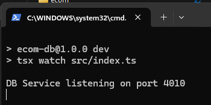

---

### 2. API Gateway (Port 4000)

Central entry point for the frontend. Uses `http-proxy-middleware` to route incoming requests to the appropriate microservice based on URL path prefixes (`/api/products` → 4001, `/api/cart` → 4003, etc.).

**Service Startup:**

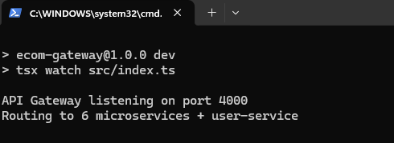

---

### 3. Product Service (Port 4001)

Handles product catalog and category management. Provides endpoints for listing products, fetching product details, and browsing by category.

**Service Startup:**

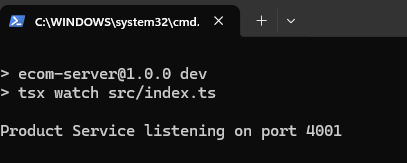

**Demo — Browsing Products:**

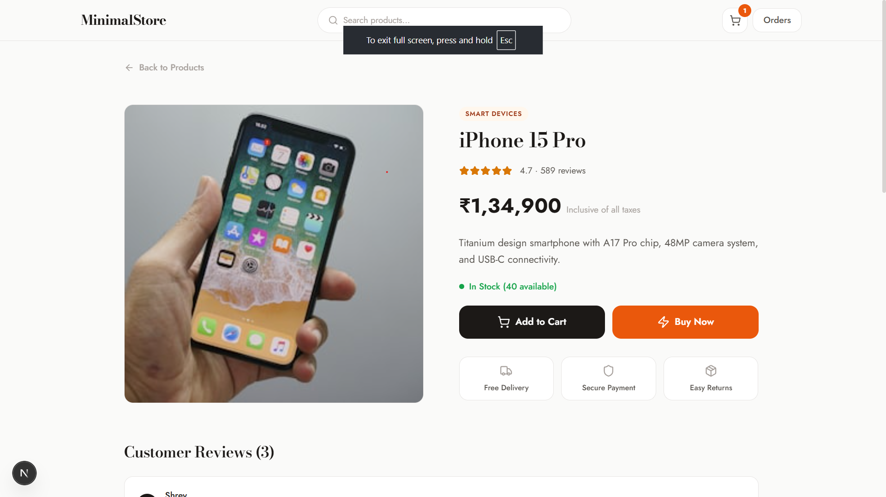

**Request Logs:**

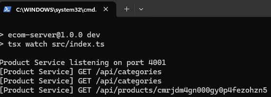

---

### 4. Search Service (Port 4002)

Full-text search across the product catalog. Supports query-based searching with results ranked by relevance.

**Service Startup:**

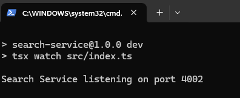

**Demo — Searching for Products:**

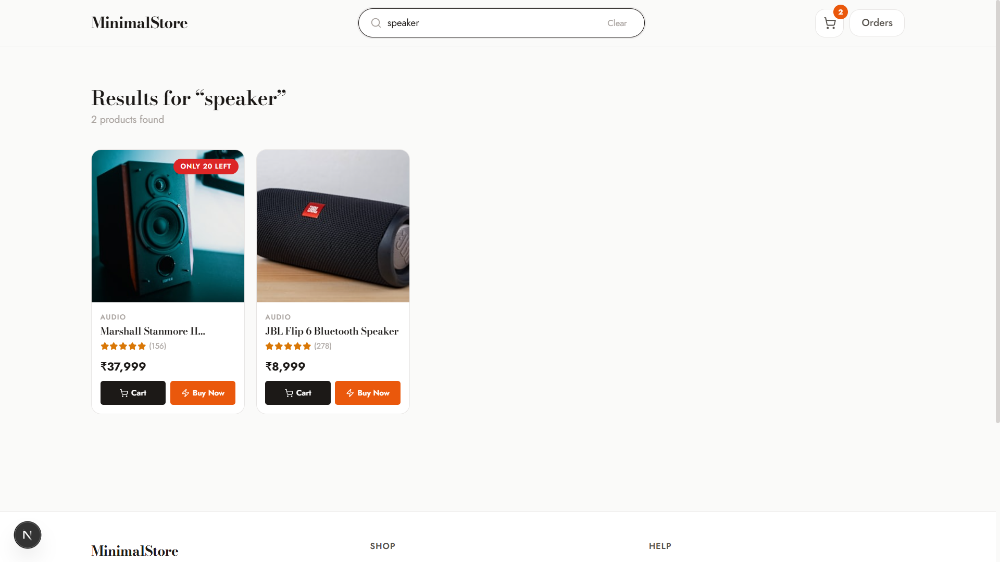

**Request Logs:**

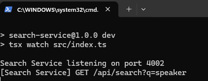

---

### 5. Cart Service (Port 4003)

Session-based shopping cart. Each browser session gets a unique cart ID stored in `localStorage`. Supports add, update quantity, remove, and clear operations — all persisted server-side.

**Service Startup:**

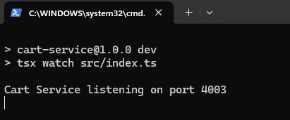

**Demo — Adding Items to Cart:**

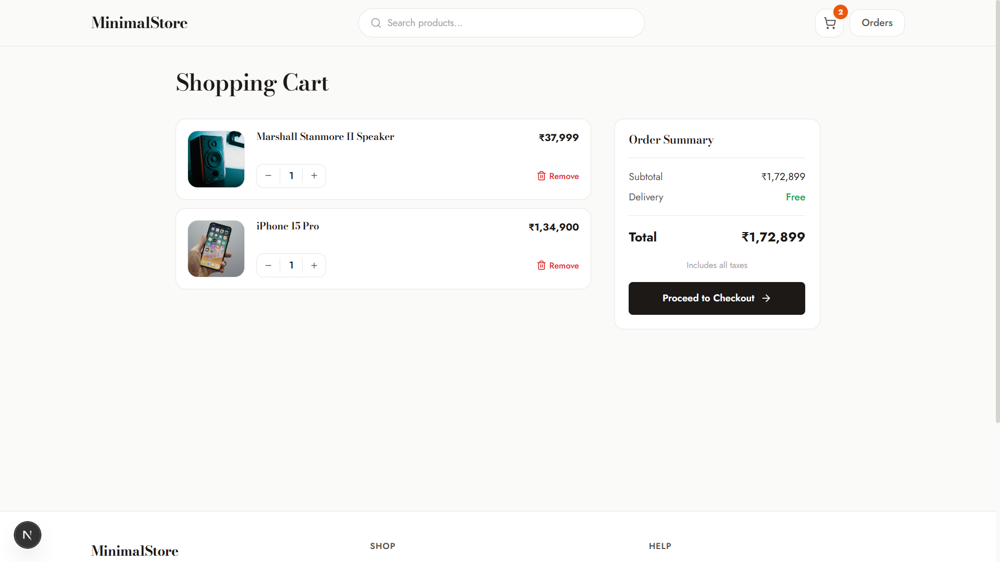

**Request Logs:**

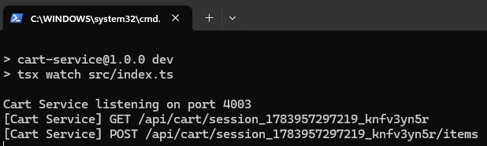

---

### 6. Order Service (Port 4004)

Manages order placement and order history. Creates orders from cart contents with shipping address and payment method, then tracks order status (pending → confirmed → shipped → delivered).

**Service Startup:**

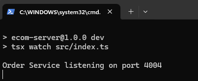

**Demo — Placing an Order:**

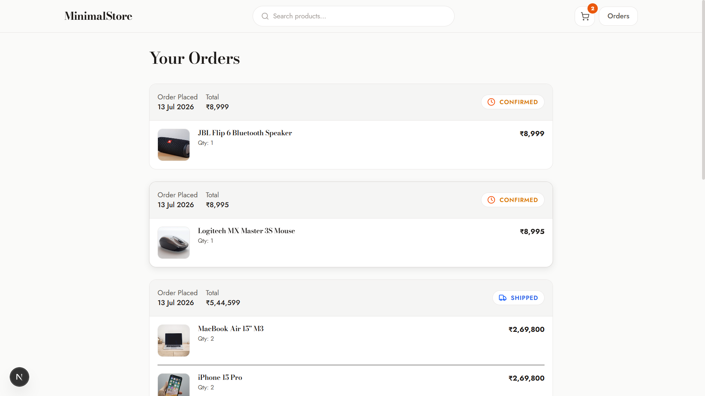

**Request Logs:**

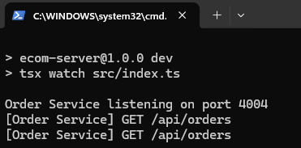

---

### 7. Payment Service (Port 4005)

Handles payment processing with support for multiple methods — UPI, Card, and Cash on Delivery. Records transaction status (pending / success / failed).

**Service Startup:**

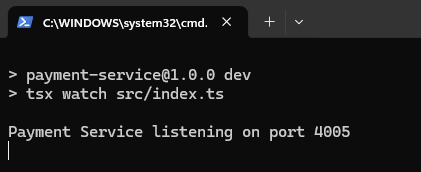

**Demo — Payment Checkout:**

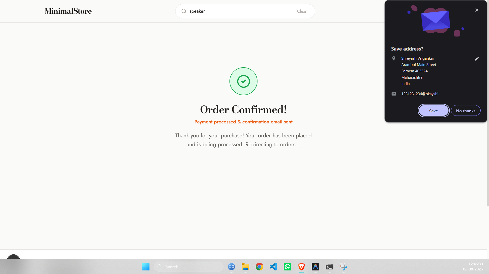

**Request Logs:**

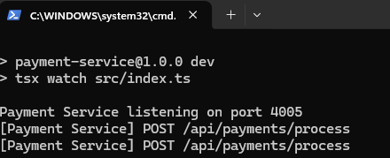

---

### 8. Review Service (Port 4006)

Manages product reviews and star ratings (1–5). Aggregates average rating and review count on each product.

**Service Startup:**

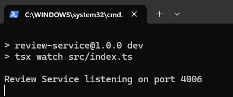

---

### 9. User Service (Port 4008)

Handles user profile management and address book (Home, Work, etc.). Provides user data for order placement.

**Service Startup:**

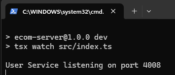

---

### 10. Frontend Client (Port 3000)

Next.js 16 application with server-side rendering for SEO and client-side interactivity. Features a responsive design with product grid, search bar, cart management, checkout flow, and order tracking.

**Service Startup:**

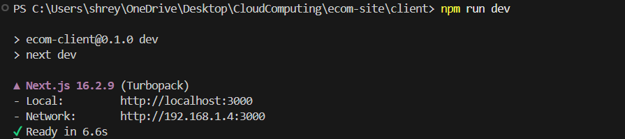

---

## 🗄 Database Schema

The application uses a relational PostgreSQL database with the following models:

| Model       | Purpose                                  |
| ----------- | ---------------------------------------- |
| `User`      | Customer profiles                        |
| `Category`  | Product categories (Audio, Laptops, etc) |
| `Product`   | Product catalog with pricing & stock     |
| `Cart`      | Session-based shopping carts             |
| `CartItem`  | Items within a cart                       |
| `Order`     | Placed orders with status tracking       |
| `OrderItem` | Line items within an order               |
| `Payment`   | Payment transactions                     |
| `Review`    | Product reviews & ratings                |
| `Address`   | User shipping addresses                  |

---

## ☁️ Cloud Computing Concepts Demonstrated

- **Microservices Architecture** — Each domain (product, cart, order, payment, search, review, user) runs as an independent service
- **API Gateway Pattern** — Single entry point that routes requests to backend services
- **Service Decomposition** — Separation of concerns enabling independent development and deployment
- **Fault Isolation** — Failure in one service (e.g., reviews) doesn't bring down the entire application
- **Independent Scaling** — Each service can be scaled based on its individual load
- **Shared Database with ORM** — Prisma provides type-safe database access across services

---

## 📄 License

This project was built for academic purposes as part of a Cloud Computing course.
